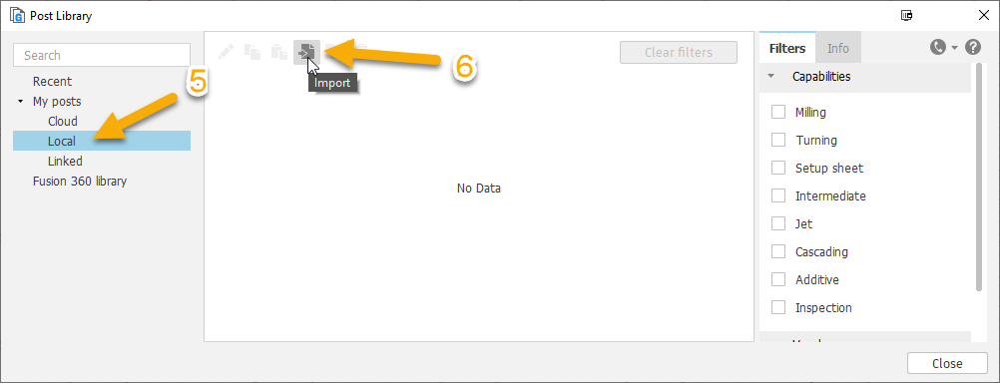
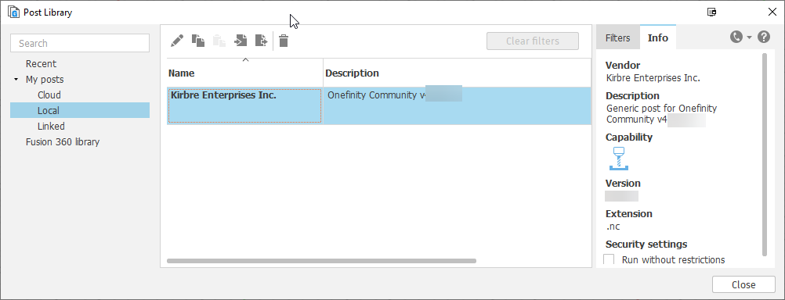
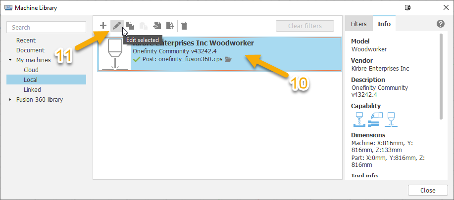

# <a name="Section">Onefinity Fusion 360 Post Processor & Machine</a>

Menu | [Overview](#overview) | [Components](#components) | [Procedures](#procedures) |
__________________________
## <a name="Important">Important</a>
Having migrated to a Onefinity Elite machine I now have limited capabilities to fully support and test the community post processor for PRO and Original Series.  Anyone wanting to take over is welcome.  
__________________________
## <a name="overview">Overview</a>
The 'Fusion' folder is part of 'onefinity-community-post-processors' GitHub Package.  

It contain these 'Community Customized Components' to be use in 'Autodesk Fusion 360':

** click on the desired component to get to the proper section
- [Onefinity Custom Post Processor](#onefinity-custom-post-library-definition).
  - The post processor file is a mandatory component.  It's a language definition file used to converts toolpaths created in a CAM software into language (NC programs) that can be read by the CNC machine's controller.
- [OneFinity Custom Machine Configuration File (distinct definition file available for woodworker, machinist and journeyman)](#onefinity-custom-machine-library-definition)
  - The machine configuration file is an optional component.  It let you define your specific machine and ressources settings in one place.  It help automate the settings in your Fusion 360 Job Setup for a particular process.

__________________________
## <a name="contributing">Contributing</a>

If you want to contribute to this project and make it better, your help is very welcome.
__________________________

Menu | [Overview](#overview) | [Components](#components) | [Procedures](#procedures) |
__________________________
# <a name="components">Components</a>
Menu | [Overview](#overview) | **Components(** [**Onefinity Custom Post Processor**](#onefinity-custom-post-processor) | [**Onefinity Custom Machine Library Definition**](#onefinity-custom-machine-library-definition) ) | [Procedures](#procedures) |

## <a name="onefinity-custom-post-library-definition">Onefinity Custom Post Processor</a>

** As explained in the overview, the post processor file is a mandatory component.  

It's a language definition file used to converts toolpaths created in a CAM software into language (NC programs) than can be read by the CNC machine's controller.

This is a customized version (see 'Features' section) of the generic post processor available from [Autodesk](https://cam.autodesk.com/hsmposts?p=onefinity).

** Information on how to proceed to [Download](#download) and [Install Post](#install-fusion-360-post-processor) can be found in the [Procedures](#procedures) section.

### Features:

-  Added new customs properties for spindle to let user add a delay and/or a pause (M0 message) when spindle speed change.
    | Property | Descrition | Type | default value |
    |----------|------------|------|---------------|
    | Spindle Delay | Insert a delay (gcode G4 Px) if time <> 0. Value (x) represent time in seconds to delay after setting spindle speed.| integer | 0| 
    | Spindle Pause|Insert a pause (gcode M0 message) to let user control waiting for a spindle.|boolean|false|
    | OutputM6EveryTool | Force output of both M6 and M0 message (MSG, Change bit to T...) for every tool change. (see also [forum](https://forum.onefinitycnc.com/t/like-many-new-forums-the-excitement-and/9209/14?u=blaghislain))|boolean|false| 
    | OutputM02InsteadOfM30 | Enable use of an M2 instead of M30 to end the program.|boolean|false|
- Custom update to enable 'useCircularInterpolation'.
    | Property | Descrition | Type | new value |
    |----------|------------|------|-------------------|
    | Circular Interpolation | Control if post processor will generate 'circular arc movement' (i.e. G02 or G03) instead of a lot of 'straight line linear movement' (i.e. G01 XYZ ) for corner, arc and circle toolpath.| boolean|true|

    Benefit if enable: 
    - Less effort for stepper motor (torque, acceleration, etc.)
    - Smoother toolpath that require less time require to cut.  
    - Smaller file size. 

- Retrofited all the Autodesk/Buildbotics changes (required by product inheritage and core component compatibility) from release 2020-11-11 to 2021-09-01.

Menu | [Overview](#overview) | [Components](#components) | [Procedures](#procedures) | 
___________________
## <a name="onefinity-custom-machine-library-definition">Onefinity Custom Machine Library Definition</a>

** As explained in the overview, the machine configuration is an optional component.  
 
 Three differents starter configuration files are provided ('**Onefinity Woodworker**', '**Onefinity Machinist**' and '**Onefinity Journeyman**')

**Machine Configuration** files are use to define available machines and resources. Each configuration file:  
  - can help automate the settings in your Fusion 360 Job Setup.
  - puts all of the information about your machine in one place. 
    
    Some of this information is used to control the manufacturing output (NC code) and the post processor functionality
      - **it is tied to a specific post processor and must generaly be update for a new revision of the 'Post Processor'**.
      - **There are a number of important branches in the tree of the Machine Configuration left panel. Go can go through each and edit (ajust or fill) in as much information as you can about your machine**.

** Information on how to proceed to [Download](#a-download-onefinity-post-processor-main-file) and [Install Machine](#c-install-onefinity-machine) can be found in the [Procedures](#procedures) section.

Menu | [Overview](#overview) | [Components](#components) | [Procedures](#procedures) | 
___________________
# <a name="procedures">Procedures</a>
| [Overview](#overview) | [Components](#components) | **Procedures**( **[Download](#a-download-onefinity-post-processor-main-file) | [Install Post](#b-install-fusion-360-post-processor) | [Install Machine](#c-install-onefinity-machine)** ) |

## <a name="download">A. Download both 'Onefinity Post Processor file' and desired 'Onefinity Machine Configuration file' </a>

 - [ ] 1. **Navigate** to the [GitHub Release Folder](./../../../releases/latest) for this repository.   
 (you may have to click on the arrow to show full files list)

 - [ ] 2. **Download** the processor file by selecting [onefinity_fusion360.cps](./../../../releases/latest) from the 'Assets list'
 - [ ] 3. **Download** one of the machine configuration files by selecting it from the 'Assets list':
   - [Onefinity Woodworker.machine](./../../../releases/latest) or
   - [Onefinity Machinist.machine](./../../../releases/latest) or
   - [Onefinity Journeyman.machine](./../../../releases/latest)

Note:  You can download all files at once usign this [link](../../../archive/refs/heads/main.zip):  

| [Overview](#overview) | [Components](#components) | [Procedures](#procedures) |
__________________________

## <a name="install-fusion-360-post-processor">B. Install Fusion 360 Post Processor</a>

**Open fusion 360 and follow these instructions:**

- [ ] 1. Open the 'WORKSPACE drop down menu'.
- [ ] 2. Select the MANUFACTURE option.

- [ ] 3. Open the 'MANAGE drop down menu'.
- [ ] 4. Select 'Post Library' option.

- [ ] 5. On the 'Post Library window' side menu, under 'My posts', select 'Local'.
- [ ] 6. Then, click on 'import' icon to open the system explorer dialog window.

- [ ] 7. Navigate to the folder where you extrated the zip file in step A.2).  
- [ ] 8. Select the file 'onefinity_fusion360.cps'
- [ ] 9. Click the 'Open' button.

**You should see the installed post processor in the 'Post Library' window**

| [Overview](#overview) | [Components](#components) | [Procedures](#procedures) | 
__________________________
## <a name="install-fusion-360-machine">C. Install Onefinity Machine</a>

**Open fusion 360 and follow these instructions:**

- [ ] 1. Open the 'WORKSPACE drop down menu'
- [ ] 2. Select the MANUFACTURE option.

- [ ] 3. Open the 'MANAGE drop down menu'.
- [ ] 4. Select 'Machine Library' option.

- [ ] 5. On the 'Machine Library window' side menu, under 'My machines', select 'Local'.
- [ ] 6. Then, click on 'import' icon to open the system explorer dialog window.

- [ ] 7. Navigate to the folder where you extrated the zip file in step A.2) 
- [ ] 8a. To install the 'Woodworker' definition, Select the file 'onefinity_woodworker.machine'
- [ ] 8b. To install the 'Machinist' definition, Select the file 'onefinity_machinist.machine'
- [ ] 8c. To install the 'Journeyman' definition, Select the file 'onefinity_journeyman.machine'
- [ ] 9. Click the 'Open' button

**You should now configure the machine you just installed to ajust the 'Post Output Folder' to your desired system folder (default to c:\\@GCODE)**

note: Change apply to all machine definition.

- [ ] 10. Select the machine to edit by cliking on it. 
- [ ] 11. Then, click on 'Edit Selected' icon to open the 'Machine Configuration' dialog window.

- [ ] 12. Navigate to the folder where you store your GCODE 
- [ ] 13. Click the 'Select Folder' button to confirm your choice.

| [Overview](#overview) | [Components](#components) | [Procedures](#procedures) |
